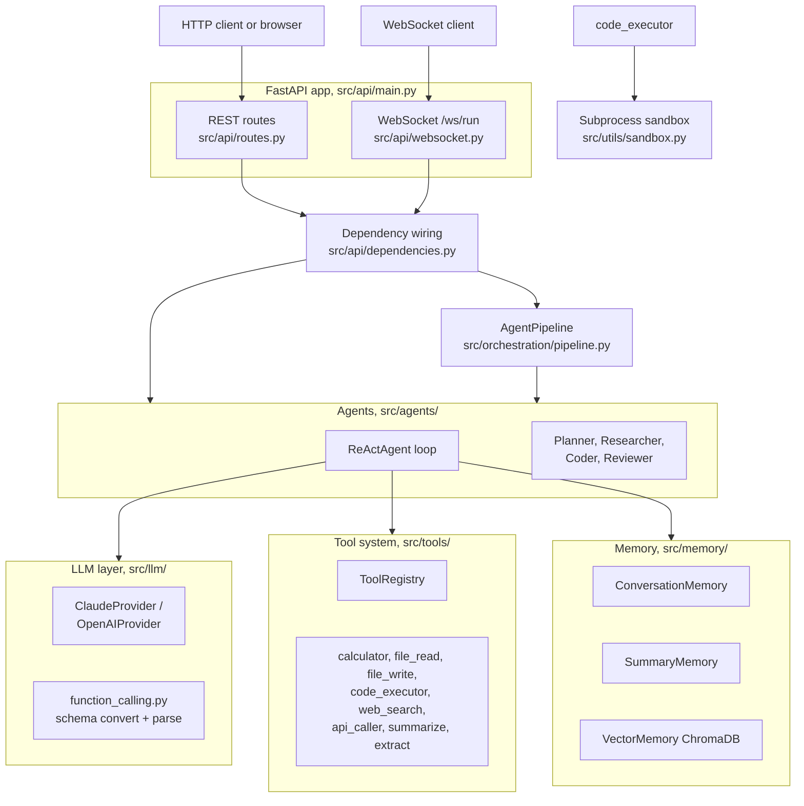

# AI Agent Framework

[](https://python.org)
[](LICENSE)

A multi-agent framework written from scratch in Python, with no agent orchestration library underneath. It gives you a ReAct reasoning loop, native LLM tool calling for Claude and OpenAI, pluggable memory backends, multi-agent orchestration, and a FastAPI server with REST endpoints plus a WebSocket that streams an agent's thoughts, actions, and observations as they happen.

The code is meant to be read. Every layer (LLM provider, tool, memory, agent, orchestrator) is a small abstract base class with concrete implementations you can follow end to end.

## What it does, in plain language

You give the framework a task in natural language. An agent sends that task to an LLM along with a list of tools the LLM is allowed to call. The LLM either answers directly or asks to call a tool (for example, "run this Python code" or "search the web"). The framework runs the requested tool, feeds the result back to the LLM, and repeats. This loop continues until the LLM produces a final answer or a step limit is hit. That loop is the ReAct pattern: Reason, then Act, then Observe.

On top of single agents, you can chain several agents in a pipeline (the output of one becomes the input of the next), and you can run the API server to drive everything over HTTP or watch a run unfold over a WebSocket.

## Key concepts

- **LLM provider**: a thin wrapper around one model vendor. `ClaudeProvider` and `OpenAIProvider` both implement the same `generate()` method and return one unified `LLMResponse`, so the rest of the code never branches on which vendor is in use. See `src/llm/provider.py`.
- **Tool**: a unit of work the LLM can invoke. Each tool declares a name, a description, and a JSON Schema for its arguments. Sync tools implement `execute()`; tools that need network or LLM calls implement `execute_async()`. See `src/tools/base.py`.
- **Tool registry**: a catalogue that holds tools, generates their schemas for the LLM, and runs them by name. See `src/tools/registry.py`.
- **Memory**: how an agent remembers earlier turns. Three backends exist: a sliding-window buffer, an LLM running-summary, and a ChromaDB vector store. See `src/memory/`.
- **Agent**: the ReAct loop plus a system prompt. The five built-in agents are the same loop with different prompts and step limits. See `src/agents/`.
- **Orchestration**: ways to combine agents. A pipeline runs them in sequence; a router classifies a task and dispatches it to one agent; a supervisor delegates sub-tasks round by round. See `src/orchestration/`.

## Quick start

```bash
git clone <your-clone-url> ai-agent-framework
cd ai-agent-framework
pip install -e ".[dev]"

# Configure
cp .env.example .env
# Edit .env and set ANTHROPIC_API_KEY (or OPENAI_API_KEY and DEFAULT_LLM_PROVIDER=openai)

# Run the tests (no API key needed; the LLM is mocked)
make test

# Start the API server
make run-api
```

`make run-api` runs `uvicorn src.api.main:app --reload --host 0.0.0.0 --port 8000` (see `Makefile`).

## The one screen to open

Open **http://localhost:8000/docs** after starting the server. That is the FastAPI Swagger UI, generated from the route definitions in `src/api/routes.py`. It lists every endpoint, shows the request and response schemas from `src/api/schemas.py`, and lets you fill in a task and click Execute to call an agent without writing any client code. A ReDoc rendering of the same API is at `/redoc` (both URLs are configured in `src/api/main.py`).

Running an agent through `/docs` does require a valid LLM API key in `.env`, because the call reaches a live model.

## Architecture



Note: the router and supervisor orchestrators (`src/orchestration/router.py`, `src/orchestration/supervisor.py`) are part of the library but are not exposed through the API. The only orchestrator wired into an HTTP endpoint is `AgentPipeline`.

## API reference

| Endpoint | Method | Description |
|----------|--------|-------------|
| `/health` | GET | Returns status, version, and counts of agents and registered tools |
| `/api/v1/run` | POST | Run a task with any agent type |
| `/api/v1/plan` | POST | Run the planner agent's `create_plan` flow |
| `/api/v1/research` | POST | Run the researcher agent's `research` flow |
| `/api/v1/code` | POST | Run the coder agent's `write_code` flow |
| `/api/v1/pipeline` | POST | Run agents in sequence |
| `/api/v1/agents` | GET | List the five agent types and their descriptions |
| `/api/v1/tools` | GET | List registered tools with their schemas |
| `/ws/run` | WS | Stream a run as thought, action, observation, result events |

### Run a task

```bash
curl -X POST http://localhost:8000/api/v1/run \
  -H "Content-Type: application/json" \
  -d '{"task": "What is 15% of 200?", "agent_type": "react"}'
```

### Run a pipeline

```bash
curl -X POST http://localhost:8000/api/v1/pipeline \
  -H "Content-Type: application/json" \
  -d '{
    "task": "Build a sorting function",
    "stages": [
      {"agent_type": "planner"},
      {"agent_type": "coder"},
      {"agent_type": "reviewer"}
    ]
  }'
```

### Stream a run over WebSocket

```python
import asyncio
import json
import websockets

async def main():
    async with websockets.connect("ws://localhost:8000/ws/run") as ws:
        await ws.send(json.dumps({"task": "Explain quantum computing", "agent_type": "react"}))
        async for message in ws:
            event = json.loads(message)
            print(f"[{event['event_type']}] {event['data']}")
            if event["event_type"] in ("result", "error"):
                break

asyncio.run(main())
```

The server accepts one JSON message with `task`, optional `agent_type`, `max_steps`, and `memory_type`, then sends back a stream of JSON events ending in a `result` or `error` event (`src/api/websocket.py`).

## Using the library directly

### Single agent

```python
import asyncio
from src.agents.react import ReActAgent
from src.llm.provider import ProviderFactory
from src.tools.registry import ToolRegistry
from src.tools.calculator import CalculatorTool

async def main():
    llm = ProviderFactory.create()
    tools = ToolRegistry()
    tools.register(CalculatorTool())

    agent = ReActAgent(llm=llm, tools=tools)
    result = await agent.run("What is 15% of 200?")
    print(result.output)

asyncio.run(main())
```

### Pipeline

```python
from src.agents.planner import PlannerAgent
from src.agents.coder import CoderAgent
from src.agents.reviewer import ReviewerAgent
from src.orchestration.pipeline import AgentPipeline

pipe = AgentPipeline(agents=[
    PlannerAgent(llm=llm),
    CoderAgent(llm=llm, tools=tools),
    ReviewerAgent(llm=llm),
])
result = await pipe.run("Build a REST API with auth")
```

### Supervisor (library only, not exposed over the API)

```python
from src.orchestration.supervisor import AgentSupervisor

supervisor = AgentSupervisor(
    llm=llm,
    agents={"coder": coder, "reviewer": reviewer},
    max_rounds=5,
)
result = await supervisor.run("Write and review a binary search")
```

## Adding a custom tool

```python
from src.tools.base import BaseTool, ToolResult

class MyTool(BaseTool):
    name = "my_tool"
    description = "Does something useful"
    parameters = {
        "type": "object",
        "properties": {"input": {"type": "string", "description": "Input text"}},
        "required": ["input"],
    }

    def execute(self, arguments):
        return ToolResult(output=f"Processed: {arguments['input']}")

registry.register(MyTool())
```

## Built-in tools

The registry exposes eight tools (`src/api/dependencies.py`):

| Tool | Module | Notes |
|------|--------|-------|
| `calculator` | `src/tools/calculator.py` | Math via an AST evaluator, no `eval` |
| `file_read` | `src/tools/file_ops.py` | Reads allowed file types inside a workspace dir |
| `file_write` | `src/tools/file_ops.py` | Writes inside the workspace dir |
| `code_executor` | `src/tools/code_executor.py` | Runs Python in a subprocess sandbox |
| `web_search` | `src/tools/web_search.py` | DuckDuckGo search, no API key |
| `api_caller` | `src/tools/api_caller.py` | HTTP requests with an optional domain allowlist |
| `summarize` | `src/tools/text_tools.py` | LLM summary, registered only when an LLM is available |
| `extract` | `src/tools/text_tools.py` | LLM extraction of entities, dates, numbers, key points |

`summarize` and `extract` need an LLM instance, so they are registered only when one is passed in. If a tool fails to construct, registration skips it and logs a debug line rather than crashing startup.

## Memory backends

| Backend | Module | How it builds context |
|---------|--------|-----------------------|
| `conversation` | `src/memory/conversation.py` | Sliding window of recent messages that fit a token budget |
| `summary` | `src/memory/summary.py` | LLM compresses older messages into a running summary, keeps recent ones |
| `vector` | `src/memory/vector_memory.py` | ChromaDB embeddings, returns recent plus semantically similar messages |

The API and WebSocket layers wire up `conversation` and `summary` only (`src/api/dependencies.py`). `vector` and the `CompositeMemory` combiner (`src/memory/composite.py`) are available when you use the library directly.

## Tech stack

| Component | Technology |
|-----------|-----------|
| Language | Python 3.11+ |
| LLM providers | Anthropic Claude, OpenAI |
| API server | FastAPI + Uvicorn |
| Streaming | WebSocket (FastAPI) |
| Vector store | ChromaDB |
| Configuration | pydantic-settings + python-dotenv |
| Logging | structlog |
| Testing | pytest + pytest-asyncio |
| Linting | ruff |
| Type checking | mypy |
| CI/CD | GitHub Actions |
| Container | Docker |

## Project structure

```
src/
  agents/         ReAct loop + planner, researcher, coder, reviewer
  api/            FastAPI app, REST routes, WebSocket, schemas, wiring
  config/         pydantic-settings configuration
  llm/            provider abstraction + function-calling format conversion
  memory/         conversation, summary, vector, composite backends
  orchestration/  pipeline, router, supervisor
  tools/          built-in tools + registry
  utils/          structlog setup + subprocess sandbox

tests/
  unit/           256 unit test functions
  integration/    23 API + WebSocket test functions

examples/         research_assistant, code_assistant, data_analyst scripts
docker/           Dockerfile + docker-compose.yml
docs/             architecture, deployment, and usage guides
```

## Development

```bash
make dev          # install with dev dependencies
make test         # run all tests
make test-cov     # tests with coverage report
make lint         # ruff check
make format       # ruff format
make typecheck    # mypy on src/
make run-api      # start the API server
```

## Running with Docker

```bash
make docker-build   # build the image from docker/Dockerfile
make docker-up      # start api + chromadb via docker/docker-compose.yml
make docker-down    # stop
```

`docker/docker-compose.yml` defines two services: the `api` service built from `docker/Dockerfile`, and a `chromadb` service from the public `chromadb/chroma` image. The API container reads `../.env`, exposes port 8000, and includes a `HEALTHCHECK` that polls `/health`. The image runs as a non-root `agent` user.

## Cloud deployment

The container image is the single deployable unit. Any platform that runs a container can run this service; the differences are which platform has config checked into this repo versus which would need their own.

- **GitHub Container Registry**: this is the only registry with config in the repo. `.github/workflows/cd.yml` builds `docker/Dockerfile` on a `v*` git tag and pushes a multi-tagged image to `ghcr.io`. CI on every push and pull request runs lint and the test matrix (`.github/workflows/ci.yml`).
- **AWS**: deploy the same image to ECS (Fargate) or App Runner, pointing the task at the image and setting `ANTHROPIC_API_KEY` (or `OPENAI_API_KEY`) plus the other variables from `.env.example`. SageMaker is a fit only if you wrap the agent as an inference endpoint. No AWS config is in this repo; you would add it.
- **GCP**: deploy the image to Cloud Run, which maps cleanly to a single HTTP container on port 8000. Vertex AI is relevant only if you host a model behind it. No GCP config is in this repo; you would add it.
- **Azure**: deploy the image to Container Apps or App Service for Containers. Azure ML Studio is for model hosting rather than this API. No Azure config is in this repo; you would add it.

For ECS, Cloud Run, Container Apps, and SageMaker, the build path is identical: reuse `docker/Dockerfile`, then add that platform's own deployment descriptor (task definition, service YAML, or pipeline). This repo ships only the GHCR push workflow.

## Algorithms and methods, with sources

- **ReAct loop (Reason, Act, Observe)**: the agent calls the LLM, and if the response has no tool calls it returns that as the final answer; otherwise it runs each tool call, feeds results back as messages, and iterates up to `max_steps`. See `src/agents/react.py:62` (the `run` loop), `src/agents/react.py:98` (no-tool-call final-answer exit), and `src/agents/react.py:194` (max-steps exhaustion).
- **Provider-agnostic tool calling**: `ToolSchema` is converted to each vendor's format and tool calls are parsed back to a common shape. See `src/llm/function_calling.py:43` (`convert_to_anthropic_tools`), `src/llm/function_calling.py:114` (`convert_to_openai_tools`), `src/llm/function_calling.py:63` and `:140` (parsing).
- **Tool argument validation**: structural checks for required keys, unknown keys, JSON Schema type matching, and enums, without a full JSON Schema validator. See `src/llm/function_calling.py:201`.
- **Retry with exponential backoff**: retries only on rate-limit and connection errors with a `2 ** attempt` wait; non-transient API status errors are not retried. See `src/llm/provider.py:116`.
- **Token usage tracking**: input and output tokens are summed per call and accumulated on the provider. See `src/llm/provider.py:41` (`TokenUsage`) and `src/llm/provider.py:112` (`_track_usage`).
- **Safe calculator via AST**: expressions are parsed to an AST and evaluated with an allowlist of operators, functions, and constants. There is no use of `eval`. Percentage syntax like `50% of 200` is rewritten before parsing. See `src/tools/calculator.py:53` (`_safe_eval`), `src/tools/calculator.py:92` (`_preprocess`).
- **Subprocess code sandbox**: code is statically scanned for a blocklist of modules, then run in a separate Python process with a timeout and an emptied `PATH`. The memory limit is advisory and not enforced on all platforms. See `src/utils/sandbox.py:55` (`check_imports`), `src/utils/sandbox.py:76` (`execute_sandboxed`), `src/utils/sandbox.py:12` (blocklist).
- **Pipeline chaining**: each agent's output becomes the next agent's input; the run stops at the first failed stage. See `src/orchestration/pipeline.py:25`.
- **LLM-based task routing**: the router asks the LLM to classify a task into one of the route names, then dispatches to that agent or a default. See `src/orchestration/router.py:34`.
- **Supervisor delegation**: the supervisor LLM emits either `DELEGATE <agent>: <sub-task>` or `DONE: <answer>` each round, capped at `max_rounds`. See `src/orchestration/supervisor.py:36` (loop), `src/orchestration/supervisor.py:124` (`_parse_delegation`).
- **Sliding-window memory**: a fixed-size deque with FIFO eviction; context walks backward and stops at a token budget. See `src/memory/conversation.py:21` and `:37`.
- **Summary memory**: when the buffer passes a threshold, older messages are compressed by an LLM into a running summary. See `src/memory/summary.py:41` (threshold trigger) and `:101` (`_summarize`).
- **Vector memory retrieval**: messages are embedded into ChromaDB; context combines the most recent messages with semantically similar retrieved ones, deduplicated and token-trimmed. See `src/memory/vector_memory.py:63` (`get_context`) and `:93` (`search`).
- **Token estimation**: uses tiktoken when it is installed, otherwise falls back to a roughly four-characters-per-token heuristic. This feeds the token budgeting in every memory backend. See `src/memory/base.py:20` (`estimate_tokens`).
- **Workspace path safety**: file tools resolve user paths inside a workspace root and reject traversal escapes. See `src/tools/file_ops.py:17` (`_resolve_safe`).
- **Web search rate limiting**: a minimum interval between DuckDuckGo requests is enforced per tool instance. See `src/tools/web_search.py:40`.

## License

[MIT](LICENSE)
</content>
</invoke>
